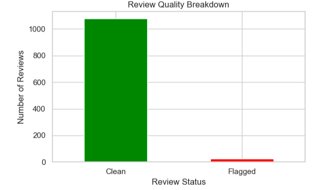

# Map Review Quality Checker

A simple data quality and analysis project that simulates QA workflows for Google Maps-style restaurant reviews. This project flags low-quality or suspicious reviews and identifies patterns by business — inspired by real-world experience working on platforms like Apple Maps and Siri.

## Project Goals

- Detect reviews that may be blank, too short or duplicated
- Analyze review quality across different businesses
- Create basic visualizations to summarize QA findings
- Simulate a data analyst’s role in improving platform trust and review integrity

## Tools Used

- **Python 3**
- **pandas** – for data loading, cleaning and flagging
- **matplotlib** – for simple data visualizations
- **Jupyter Notebook** – for interactive development

## Data Quality Checks

The following flags were applied to each review:

- `flag_blank`: Review is empty or just whitespace
- `flag_too_short`: Review has fewer than 10 characters
- `flag_duplicate`: Review appears more than once in the dataset
- `flag_any_issue`: Combines the above into a single indicator

## Sample Output

- 1,100 total reviews analyzed  
- 24 reviews flagged for quality issues  
- Top businesses with flagged reviews identified  
- Clean vs. flagged review breakdown visualized in bar chart

## Files in This Repo

- `1.ipynb`: Main notebook with all data exploration, flagging, and plots
- `cleaned_reviews_with_flags.csv`: Final dataset with QA columns added
- `README.md`: This file

